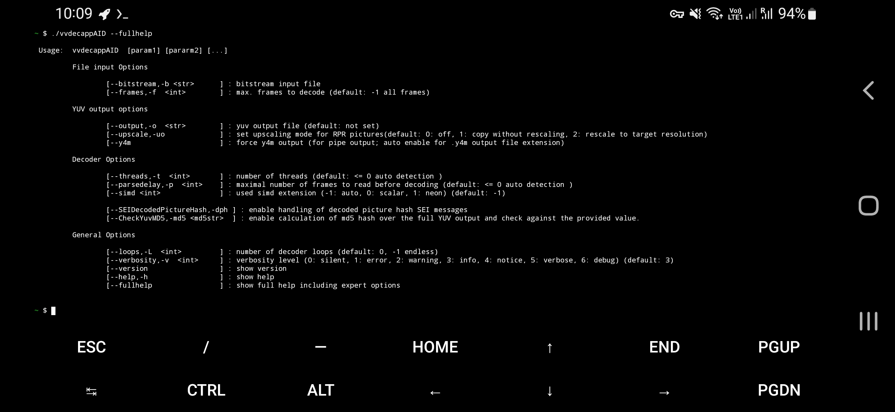
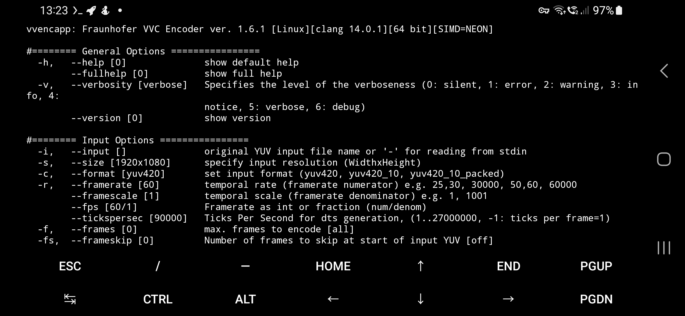
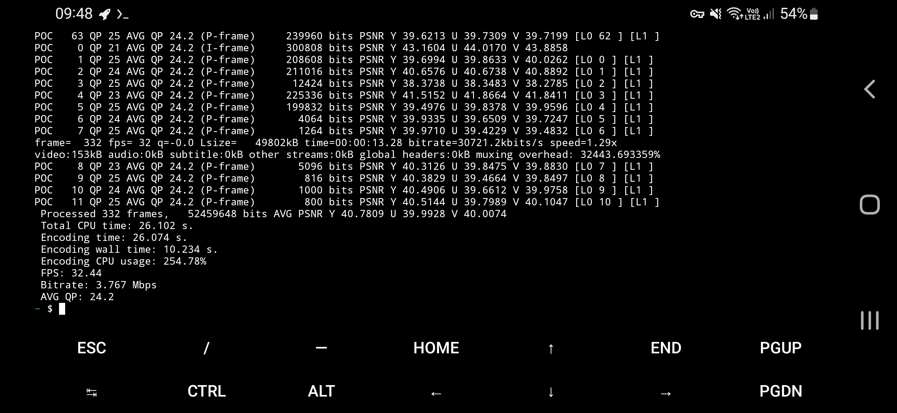

# Android vvenc & vvdec/uvg266 applications (Termux app)

Requirements: Termux app with apk, F-Droid app or ADB connection. For uvg266/vvenc/vvdec pipe, you need FFmpeg installed requirement on Termux app.

See the screenshot of vvdecapp in Termux app:



All system types of arm64, armeabi, x86 and x86_64 is built on vvdec, vvenc & uvg266, it is use of Termux app.

- arm64 - API 21 (64-bit phones & tablets only)
- x86_64 - API 21 (64-bit tablets/phones only)
- armeabi - API 19 (32-bit phones)
- x86 - API 19 (32-bit tablets only)

TIP: You can install my built VVC binaries:

```bash
chmod +x vvdecapp uvg266 vvencapp
cp vvencapp vvdecapp uvg266 $PREFIX/bin
```

## vvencapp encoder (Fraunhofer HHI)

Screenshot (tested my phone):



### uvg266 encoder (Scalable video encoder)

Screenshot:



Before you download, there were two separated programs:

- AndroidUVG266.7z - 10-bit input/encoder only.
- AndroidUVG266-8bit.7z - 8-bit input/encoder only.

If you want pipe from FFmpeg to uvg266, you can do command:

```bash
ffmpeg -i example.mp4 -f yuv4mpegpipe -pix_fmt yuv420p10 -strict -1 - | uvg266 -i - --input-file-format y4m --input-bitdepth 10 -o converted.266
```

For 8-bit uvg266 application, remove `-strict -1`, change from `yuv420p10` to `yuv420p` and remove `--input-bitdepth-10`.

When you want make device sleep during uvg266 encoding, tap **Acquire wake lock** on Termux notification.

If uvg266 froze itself for couple minutes without printing the info, it means finished, tap CTRL + C.

VVDEC might not decode with some uvg266 options (example uvg266 presets unplayable with vvdec: preset placebo & lossless.

- Martin Eesmaa
