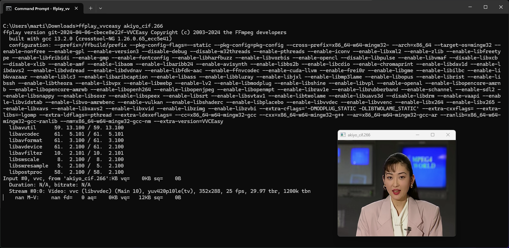
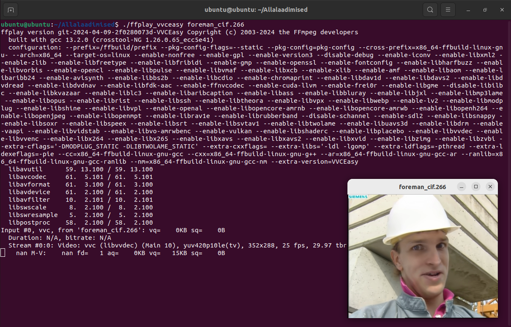

# FFmpeg VVC En/decoder & xHE-AAC installation (Windows, Mac OS and Linux)

Windows, Mac and Linux (Preview of VVC video in FFplay):





# Play video file

You can play VVC video codec with .h266, .vvc, .266 and anything or .mp4 mixed with VVC codec:

```
ffplay_vvceasy versatile.266
```

Or if you have xHE-AAC audio codec:

```
ffplay_vvceasy -codec:a libfdk_aac -i versatile.m4a
```

# Official FFmpeg VVC native decoder implementation

It started at January 4 2024 when the native VVC decoder is released on FFmpeg, but it was experimental without IBC (Intra Block Copy).

On February 24 2024, the finally moment about Intra Block Copy has been merged into FFmpeg's official repository, which means native VVC decoder on FFmpeg is completed and it's stable.

His hard work is very good and made by [nuomi2021](https://github.com/nuomi2021) to make native VVC decoder release to FFmpeg.

Now you can use official FFmpeg binaries by BtBn or Gyan or my custom build of FFmpeg VVCEasy build to play or decode VVC in FFmpeg. Also mpv too with shinchiro or VVCEasy builds. :)

But for libvvenc VVC encoder has not implemented yet into official FFmpeg. FFmpeg VVCEasy build has still libvvenc VVC encoder available by Martin Eesmaa's FFmpeg-VVC repository.

# Official FFmpeg VVC external encoder implementation

On 15th June 2024, the external VVC encoder feature is released on FFmpeg.

See commit: https://github.com/FFmpeg/FFmpeg/commit/c75940db290478df657c09089605d221dc47118e

His hard work was very good and made by Thomas Siedel, authored by nuomi2021 and also co-authored by Christian Bartnik.

This might come later to add feature after compiling for FFmpeg Gyan and BtBn builds, but FFmpeg VVCEasy builds is still available.

# Limitations of FFmpeg VVC encoder

Before encode to VVC video codec, see the limitations below.

libvvenc (FFmpeg vvc version) works for:

- Pixel format ⚠️ (only pixel format 10 bit is default, but you can still encode 8 bit by using `-bitdepth8 1`)
- Video size (auto detects, but it doesn't detect for SAR and DAR anamorphic is glitch and corrupts the video) ⚠️ (Better way to use vvencapp without FFmpeg)
- Frame rate ✅ (auto detects)
- MP4/TS Mux ✅ (only works for stable if it's encoded VVC with MP4 or TS on FFmpeg and mp4box for muxing still works)
- Mux MP4/TS container from raw bitstream on FFmpeg ⚠️ (the first frame freezes may just print error messages for libvvdec when muxed and seeking in FFmpeg, use mp4box for recommendation)
- Matroska mux ⚠️ (Only matroska mux has an experimental, causing problem of the video sync delay with audio and others for FFmpeg libvvdec. It is unofficial support)
- Demux ✅
- Audio with encode VVC ✅
- Broadcasting ✅ (MPEG-TS)
- Streaming ✅ (MPEG-DASH)
- Bitrates ✅ (average (`-b:v`) and maximum bitrate (`-maxrate`) are only supported)
- Passes ⚠️ (you may need get passes using vvenc params on FFmpeg VVCEasy or use vvencapp, also it is only available to use bitrate for two passes, QP supports only one pass)
- Presets ✅
- QP ✅
- HDR ✅

Built in libvvenc for FFmpeg command:

```
ffmpeg -i example.mp4 -c:v libvvenc -qp 37 -preset slow example.266
```

For more options for libvvenc in FFmpeg VVCEasy version, type `ffmpeg_vvceasy -h encoder=libvvenc` for available commands.

Additional command: You can convert to VVC video without taking a much space for vvencapp, example:

```
ffmpeg -i example.mp4 -pix_fmt yuv420p -f yuv4mpegpipe - | vvencapp --y4m -i - --preset medium --qp 35 -o converted.266
```

Converting xHE-AAC to AAC audio:

```
ffmpeg -c:a libfdk_aac -i mymusic.m4a -c:a aac -b:a 128k mymusic.aac
```

Replace video size for `-s` and frame rate for `-r`.

### Update 21th May 2022 of FFmpeg vvdec support

Good news, you can play .mp4 file after .h266 and audio format were merged into mp4 playable of VVC.

About [xHE-AAC](https://www.iis.fraunhofer.de/en/ff/amm/broadcast-streaming/xheaac.html), now it's available decode support xHE-AAC of FFmpeg. [Exhale](https://gitlab.com/ecodis/exhale) (encoder) is free to use and open source, but if you want Fraunhofer IIS xHE-AAC, you can download [EZ CD Audio Converter](https://www.poikosoft.com/music-converter) for Windows only. You can also merge your encoded xHE-AAC audio into mp4 too.

To make playable mp4 with audio and video together, you need VVC video encoded, audio file and [GPAC Nightly build](https://gpac.wp.imt.fr/downloads/gpac-nightly-builds/). Code for mp4box/gpac to merge VVC video encoded and audio file:
```
mp4box -add video.266 -add audio.m4a -new convertedvvc.mp4
```

Containers are also acceptable video containers of .mkv, .mp4, .mov and more.

For Linux and Mac OS users: Replace **mp4box** by **gpac**

# FFmpeg Downloads (xHE-AAC & VVC en/decoder plugin compiled by Martin Eesmaa)

[Windows x64](https://mega.nz/file/epNUxKoL#E0QsfXL0fCWzmnTtnEJ8QuRNI8zX9y1gt5feEKnnVxI)

[Mac OS x86_64](https://mega.nz/file/et1mUbRI#HQMK-85P2Cq3EuUhkkjBojr4vBffvqE4eBw68jRT1aQ)

[Mac OS arm64](https://mega.nz/file/OpUXxZ7A#NzV997Fq-VR0lBH9Rr5EPqgNNkvHAiOMKTdFEhAydKo)

[Linux x64](https://mega.nz/file/65ESlYTC#TIhlcHj-WS7tgwUB4Mjp-0MjOaNU62mNH0WepjLWd-8)

[Linux Arm64](https://mega.nz/file/j9VQBCSZ#qmz6KfK9NncU6kvfB66-dQc7t-7s83iTGpw9FoFz0QA)

[FFmpeg-FixVVC archived old source code](https://mega.nz/file/G81QyT5S#jcbE1sYPEy1OMIDPCF8BPeAK-3KAGF50u23MVJzmBgw) (old)

### Note about downloads

Also, please check changelog before you download the new version.

### Changelog
```
30/06/2024: Updated FFmpeg with latest nightly, vvenc and others. Added support of SVT-HEVC and SVT-VP9 external libraries to FFmpeg VVCEasy builds for Windows & Linux x86_64 only.
28/06/2024: Updated FFmpeg with latest nightly, vvenc, vvdec and others. New Film Grain Synthesis (FGS) has added to vvenc (experimental) and vvdec.
22/06/2024: Updated FFmpeg with latest nightly, vvenc and others.
21/06/2024: Fix macOS x86_64 FFmpeg VVCEasy build from wrong architecture and added already support macOS FFmpeg VVCEasy arm64 build.
16/06/2024: Updated FFmpeg with latest nightly, officially new libvvenc feature to official FFmpeg, updated vvenc, vvdec and others.
06/06/2024: Updated FFmpeg with latest nightly, added experimental xHE-AAC native decoder, but I turned it off to avoid problems.
05/06/2024: Updated FFmpeg with latest nightly, vvenc, vvdec and others.
08/05/2024: Updated FFmpeg with latest nightly, vvdec and others.
29/04/2024: Updated FFmpeg with latest nightly and others. Added official VVC Matroska tag of V_MPEGI/ISO/VVC in libavformat/matroska.c.
24/04/2024: Updated FFmpeg with latest nightly, added SAC (State of the Art Codec) demuxer (code by Martin Eesmaa), aom, x264, x265, dav1d and others.
18/04/2024: New Linux Arm64 FFmpeg VVCEasy build. Updated FFmpeg, libopus and others.
09/04/2024: Updated FFmpeg with latest nightly and added early LC3 muxer & demuxer can encode, decode and play LC3 by liblc3 (Windows & Linux are already have liblc3) from FFmpeg patchwork.
06/04/2024: Updated FFmpeg up to 7.0 latest with nightly, others & added Google LC3 encoder/decoder using liblc3 feature to Windows and Linux.
31/03/2024: Updated FFmpeg, vvenc, libopus and others.
19/03/2024: Updated FFmpeg, vvenc, libopus and others. Official commit set native VVC decoder is experimental, now decodes default VVC video by using external libvvdec.
04/03/2024: Updated FFmpeg, vvenc, vvdec, libopus and others. Added libdvdnav and libdvdread, especially libdvdcss to Windows & Linux. Switched from external VVC decoder (libvvdec) to native VVC decoder by removing experimental.
01/03/2024: Updated limitations of FFmpeg VVC encoder in FFMPEGVVC.md
29/02/2024: Note about official FFmpeg and VVCEasy builds can play stable video of VVC for playing via decode, but libvvenc (external VVC encoder via vvenc) is still available on FFmpeg VVCEasy builds. I'll release soon later...
15/02/2024: Updated FFmpeg and vvdec. Set libopus from stable to nightly latest version for improve with Windows & Linux.
27/01/2024: Updated FFmpeg, vvenc, vvdec and others. Added libbs2b, libcdio and libmodplug features to Windows and Linux for DSP, Audio CD and MOD.
26/01/2024: Updated FFmpeg & vvdec. Added libxavs & libsnappy features to Windows and Linux for Chinese AVS & Vidvox Hap external video encoders.
19/01/2024: Updated FFmpeg, vvenc and vvdec.
16/01/2024: Updated FFmpeg and added libspeex & libshine encoder features into FFmpeg VVCEasy builds for Windows & Linux.
15/01/2024: Updated FFmpeg, vvenc, vvdec and other libraries. Added AMR-WB & iLBC encoder using libvo_amrwbenc & libilbc to FFmpeg for Windows and Linux (except only for ilBC encoder on Linux build), but for Linux build does not include iLBC encoder for linking failed to FFmpeg reason about PIE.
27/12/2023: Updated FFmpeg, vvenc and other libraries.
16/12/2023: Updated FFmpeg, vvenc and other libraries.
06/12/2023: Updated FFmpeg and other libraries.
28/11/2023: Updated FFmpeg and others.
22/11/2023: New FFmpeg VVCEasy Linux complete static build using BtbN FFmpeg-Builds script of my forked repository. FFplay is now working and no broken.
22/11/2023: New FFmpeg VVCEasy Windows build cross compiled on Linux using BtbN FFmpeg-Builds script of my forked repository.
17/11/2023: Enable all filters via additional configuration of GPL 3 and non-free. Updated FFmpeg and others.
12/11/2023: New FFmpeg 6.1+ latest VVCEasy build with updated vvenc, vvdec and others. Released new Mac OS x86_64 build.
10/10/2023: Updated FFmpeg features with vvenc and vvdec on Windows build.
21/09/2023: Added zimg and soxr features build configuration on Windows FFmpeg.
20/09/2023: Update vvenc & libraries on FFmpeg.
16/09/2023: Update libraries.
11/08/2023: Update vvdec.
07/08/2023: Added Ittiam Systems MPEG-H 3D Audio encoder and others were updated.
30/07/2023: Updated external features, including vvenc & vvdec. Added XPSNR filter support.
22/06/2023: Updated Linux FFmpeg by FFmpeg commits and other libraries. (still does not work for FFplay static only, others working fine)
21/06/2023: Updated vvenc and FFmpeg commits.
17/06/2023: Updated of vvenc, vvdec, dav1d, FFmpeg commits and others.
01/05/2023: Added missing libvmaf feature in FFmpeg VVCEasy only.
19/04/2023: Updated of vvenc, vvdec, FFmpeg commits and others.
03/04/2023: New FFmpeg master latest VVCEasy builds with updated vvenc, vvdec and added libvmaf & libjxl. Removed AC4 for compilation/decoder errors for new AC4 audio files.
03/02/2023: Updated vvenc library on Windows FFmpeg VVCEasy build.
02/02/2023: Updated vvenc library and others on Windows FFmpeg VVCEasy build.
29/01/2023: Updated vvenc, vvdec and other libraries on Windows FFmpeg VVCEasy build.
10/01/2023: Updated vvenc latest and others.
05/01/2023: Update Linux FFmpeg static builds (still does not work for FFplay static only, others working fine)
30/12/2022: Improved vvenc codes of FFmpeg VVCEasy, thanks Thomas Siedel from Spin Digital! TIP: Type "ffmpeg_vvceasy -h encoder=libvvenc" for FFmpeg vvenc available. See the new vvenc patch: https://patchwork.ffmpeg.org/project/ffmpeg/list/?series=7922
23/12/2022: Update all libraries, fix MP4-ALS mono audio & added libcodec2 to FFmpeg.
07/12/2022: Update vvenc, vvdec and others. Fixed Windows N version. (#22)
20/10/2022: Add Linux static binaries of FFmpeg, but only FFplay does not work only.
11/10/2022: Removed libvorbis + updated SDL2 latest.
10/10/2022: Revert from flt to s16 for two decoders of libvorbis & libspeex.
10/10/2022: Removed libvmaf (reason: not working), added libvorbis + libspeex improve decode quality. 
30/09/2022: Improved vmaf (float, built models to FFmpeg) & updated sdl2. Update: Fixed libvmaf models
24/09/2022: Improved libvmaf up to date of FFmpeg code + update dav1d & vvenc.
07/09/2022: Added Dolby AC4 decoder + updated vvenc/vvdec.
01/09/2022: Added libopus with latest version for improve decode quality, libdav1d and libvmaf (optional if they want calculate score by vvc video and original video).
29/08/2022: Brought back vvenc.
```

# Mac OS downloaders (Important note)

Please note, this is not a malware of my compiled build, see the three screenshots to make run FFmpeg tools customized version

You need to allow the app on your Mac OS for chmod write access & Security & Privacy:

Step 1: Click cancel button, do not move to bin.


Step 2: Go to Security & Privacy on Mac OS Settings app, then check App Store & identified developers or anywhere is on. Click "Allow anyway" to unblock an application.


Step 3: Click "Open" button, this does not hurt your computer.


### Build Mac OS for FFmpeg VVC build

Requirements:

Xcode

CMake

NASM

Homebrew

Code to build FFmpeg VVC version:

```
brew install libxml2 ffmpeg nasm
git clone https://github.com/fraunhoferhhi/vvenc
git clone https://github.com/fraunhoferhhi/vvdec
git clone https://github.com/mstorsjo/fdk-aac
cd vvenc && mkdir build && cd build
cmake -DCMAKE_BUILD_TYPE=Release -DCMAKE_INSTALL_PREFIX=/usr/local ..
sudo cmake --build . --target install -j $nproc
cd ../../
cd vvdec && mkdir build && cd build
cmake -DCMAKE_BUILD_TYPE=Release -DCMAKE_INSTALL_PREFIX=/usr/local ..
sudo cmake --build . --target install -j $nproc
cd ../../
cd fdk-aac && ./autogen.sh && ./configure
make -j
sudo make install
cd ../
git clone --depth=1 https://github.com/MartinEesmaa/FFmpeg-VVC
cd FFmpeg-VVC
export PKG_CONFIG_PATH=/usr/local/lib/pkgconfig
./configure --enable-libfdk-aac --enable-libvvenc --enable-libvvdec --enable-static --enable-pic --enable-libxml2 --pkg-config-flags="--static" --enable-sdl2
make -j
```

# Linux builders (Important for FFplay) (old)

You can build using [Linux script](libvvdecffmpeg.sh).

If you want actually play VVC file with FFplay on your local distro, you need to remove command `--extra-ldexeflags="-static"`, otherwise it might give result segmentation fault for FFplay static only.

If compiling is success and finished, you can install FFmpeg VVC for using the code:

```
mv ffmpeg ffmpeg_vvceasy
mv ffplay ffplay_vvceasy
mv ffprobe ffprobe_vvceasy
sudo cp ffmpeg_vvceasy ffplay_vvceasy ffprobe_vvceasy /usr/local/bin
```

# Compile FFmpeg-Builds for Windows & Linux

If you want to compile your own FFmpeg with VVC support + xHE-AAC, here's what you need to do:

You may need:
- Any Linux distribution to cross-compile for Windows & Linux. Recommended architecture for x86_64 (amd64) to make faster compiling.
- Docker Engine (https://docs.docker.com/engine/install/)
- Git for clone repository to local computer.
- Network connection for downloading repositories.


Step 1: You need to install Docker Engine and to use shell script on Linux or maybe possible Windows using MSYS2.

On Arch Linux, install: `sudo pacman -S docker`.

Step 2: After installing Docker Engine, clone the repository following by:

```
git clone --depth=1 https://github.com/MartinEesmaa/FFmpeg-Builds
cd FFmpeg-Builds
chmod +x *.sh
```

If you have not installed Git, please install Git on your package manager on your Linux distribution.

Step 3: Make image and build FFmpeg, example you can build one or two builds.
```
./makeimage.sh win64 nonfree && ./makeimage.sh linux64 nonfree
./build.sh win64 nonfree && ./build.sh linux64 nonfree
```

Non-free allows to enable Fraunhofer FDK feature, other licenses may not allow to bring Fraunhofer FDK feature to FFmpeg.

Step 4: After making image and building FFmpeg, you can look `artifacts` folder by inside compressed files of Windows & Linux.

### Troubleshooting

1: If you tried to make image and you got permission denied after trying to run Docker as non-root user.

To fix the issue and make grant access permission Docker to your user:

```
sudo groupadd docker
sudo usermod -aG docker $USER
newgrp docker
```

After these commands, try again to build image again.

If it's still error, reboot the machine.

2: If the network connection is interrupted or disconnected while downloading repository and made timed out, it is recommended to cancel and retry again.

Press CTRL + C on your keyboard and try it again with make image or/and build FFmpeg command.

3: If that did not work for you, please create an issue to VVCEasy or join communities of Discord, Revolt or/and Matrix to solve your problem.

# Special thanks

VVC programmers of FFmpeg:

Original author: [@FFmpeg](https://github.com/FFmpeg) Repository: https://github.com/FFmpeg/FFmpeg

[@lehmann-c](https://github.com/lehmann-c) (Christian Lehmann) Repository: https://github.com/lehmann-c/FFmpeg

[@tbiat](https://github.com/tbiat) (Thibaud Biatek) Repository: https://github.com/tbiat/FFmpeg

VVC encoder programmer to FFmpeg: [@IsaMorphic](https://github.com/IsaMorphic) (Isabelle Santin) Repository: https://github.com/IsaMorphic/FFmpeg-VVC

[@MartinEesmaa](https://github.com/MartinEesmaa) (Martin Eesmaa) Repository: https://github.com/MartinEesmaa/FFmpeg-VVC

[@NuoMi](https://github.com/nuomi2021) of some codes and [Thomas Siedel](https://patchwork.ffmpeg.org/project/ffmpeg/list/?series=8577) of new external VVC encoder & decoder, also native VVC decoder ([ffvvc](https://github.com/ffvvc/FFmpeg)) by NuoMi.

AC4 decoder programmer to FFmpeg: [@richardpl](https://github.com/richardpl) (Paul B Mahol) Repository: https://github.com/richardpl/FFmpeg/tree/ac4

AC4 support in mp4 container: [@AUGxhub](https://github.com/AUGxhub) Repository: https://github.com/AUGxhub/FFmpeg/tree/patch-1

-   Martin Eesmaa
