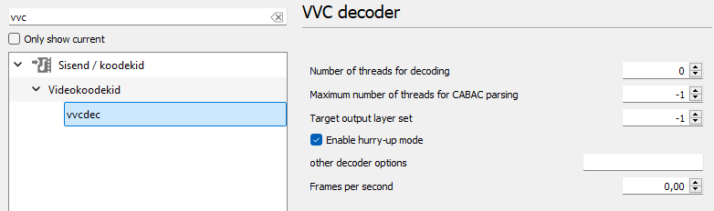

# VLC Media Player (Inter Digital VLC VTM Decoder Plugin installation of Windows and Linux)

This can work only for VLC 3.0.9.2 and later version (e.g., 3.0.17.4). VLC 4.0.0-dev or below than version 3 won't work.

To install Inter Digital VLC VTM Decoder Plugin, you need VLC Media Player latest version installed on your computer and supported 64-bit.

Step 1: Copy libvtmdec.dll and libvvcdecoder_plugin.dll into your VLC Media Player folder following folder: VLC/plugins/codec

C:\Program Files\VideoLAN\VLC\plugins\codec

Step 2: Copy libvvctsdemux_plugin.dll into your VLC Media Player folder following: VLC/plugins/demux

C:\Program Files\VideoLAN\VLC\plugins\demux

Step 3: Enjoy and play your h266 file into your VLC Media Player :).

## Explanation

I have great news. VLC latest version worked out well of Inter Digital VTM plugins. On o266player, there were some problems on my computer for one reason...

One reason that my Windows 11 operating system won't view video of VVC file on o266player version. On VTM plugins of VLC, now it shows me VVC video good.

Here is a comparison of o266player version and VTM VVC plugins:

Top left and right is o266player by Tencent Cloud.

Bottom left and right is VLC VTM plugins by Inter Digital Inc.


***UPDATE of 19/04/2022 00:20 AEST:***

Bug of Inter Digital VTM VLC Plugin:

When you try to play your MPEG-TS or TS file, it will crash with your InterDigital VLC VTM Plugin installed on your VLC Media Player.

Without InterDigital VLC VTM Plugin, playing MPEG-TS or TS file will play fine in your all original plugins (except VLC VTM Plugin) on your VLC Media Player.

### For Linux users

Open terminal and copy code:

```bash
sudo cp libvvcdecoder_plugin.so libvtmdec.so /lib/x86_64-linux-gnu/vlc/plugins/codec
sudo cp libvctsdemux_plugin.so /lib/x86_64-linux-gnu/vlc/plugins/demux
```

VLC from Snap Store:

```bash
sudo cp libvvcdecoder_plugin.so libvtmdec.so /snap/vlc/2344/usr/lib/vlc/plugins/codec
sudo cp libvctsdemux_plugin.so /snap/vlc/2344/usr/lib/vlc/plugins/demux
```

Preview:


# Customize playback frame rate

If you want to customize playback frame rate per second, here's you can do in VLC media player if the VVC decoder plugin is installed.

Here are steps:

Step 1: Open VLC media player, go to Tools -> Preferences or press CTRL + P.

Step 2: Toggle All in show settings, see the very bottom-left.

Step 3: Search for "vvcdec" and you can see the available vvcdec options.

You may see after steps following the screenshot:



Reference from original issue at [#61](https://github.com/MartinEesmaa/VVCEasy/issues/61) on GitHub.

# Build VLC InterDigital Plugin

Explanation of CMAKE names:

```text
VLC_INCLUDE_DIR = Includes of VLC SDK Plugins
VLC_LIB_DIR = Libs of VLC SDK
VLC_PROGRAM_DIR = VLC Program directory
VTMDEC_LIB_NAME = Name title of libvtmdec
VTM_DIR = libvtmdec source files
VLC_SRC_DIR = VLC Source files of the desktop version
DVBPSI_DIR = DVBPSI source files
```

## Windows

You need the CMAKE GUI, Visual Studio 2017 or newer, [VLC SDK Win64 3.0.9.2](https://download.videolan.org/pub/vlc/3.0.9.2/win64/) or [latest version](https://download.videolan.org/pub/vlc) (choose zip or 7z only), VLC source files .tar.xz, [libvtmdec](https://vcgit.hhi.fraunhofer.de/delagrangep/VVCSoftware_VTM/-/tree/VTM-22.2-MT) precompiled shared dll in lib folder + sources, dvbpsi source and VLC source files of the desktop version. You need to modify vlc_threads.h, before compile.

vlc_threads.h can be found in VLC folder/sdk/include/vlc/plugins. Search `val = poll(fds, nfds, timeout);` and comment the only one file, that's it.


Build Decoder Plugin, see screenshot of CMAKE GUI:


Before building TS demuxer plugin, please download source code of VLC 3.0.9.2 or latest version following .tar.xz file container and decompress to vlc-3.0.9.2/src or latest version like example vlc-3.0.2.0/src:

<https://download.videolan.org/pub/vlc/3.0.9.2/vlc-3.0.9.2.tar.xz>

For latest version, you need to find latest version by looking ascending:

<https://download.videolan.org/pub/vlc>

Build TS Demuxer Plugin, see screenshot of CMAKE GUI:


## Linux

You need CMAKE GUI, build-essentials, VLC SDK (you have to get from Windows build of 7z or zip compressed file that contains `sdk/lib` and `sdk/include` folders), [libvtmdec](https://vcgit.hhi.fraunhofer.de/delagrangep/VVCSoftware_VTM/-/tree/VTM-22.2-MT) sources, dvbpsi source and VLC source files of the desktop version. You need to modify vlc_threads.h, before compile.

Please double-click downloaded compressed file and decompress VLC Windows SDK build to anywhere folder for example "~/vlc-3.0.9.2" or you can use CLI like 7-Zip `7z x vlc-3.0.9.2-win64.7z -o$HOME`.

vlc_threads.h can be found in VLC folder/sdk/include/vlc/plugins. Search `val = poll(fds, nfds, timeout);` and comment the only one file, that's it.


libvtmdec build:
Compiled file could be found in lib folder in libvtmdec.

```bash
mkdir build && cd build
cmake -DCMAKE_BUILD_TYPE=Release ..
make -j
```

Before build Decoder Plugin, you need to find libvlccore in Linux.

### Option 1 (recommended)

To find libvlccore, you can simply install VLC by your package distribution like apt, pacman or Snap.

Most Linux package version can be found libvlccore:

```bash
/usr/lib/x86_64-linux-gnu/libvlccore.so.9.0.0
```

On Snap store version, the latest version of VLC can be found, but the numbers are different:

```bash
/snap/vlc/3777/usr/lib/libvlccore.so.9.0.1
```

If you can't find it, you can find libvlccore on `/` folder.

```bash
sudo find / -type f -name 'libvlccore.so*'
```

You can pick Linux package or Snap version, if unsure pick Linux package standalone or only that you installed on Linux package or Snap version.

### Option 2 (optional)

If you don't want to find libvlccore and you don't want to get libvlccore installed on Linux package or Snap package, you can build source code of VLC shipped inside libVLC.

Instructions can be found there of LibVLC:

<https://wiki.videolan.org/LibVLC#Compiling>

If option one or/and two didn't work, you can create issue to [VLC Forums](https://forum.videolan.org) or/and VVCEasy, so the VLC community or I/we can help you to solve your problem.

dvbpsi build requires of TS Demuxer Plugin:

```bash
./bootstrap
./configure --enable-release
make -j
sudo make install
```

Build Decoder Plugin, see screenshot of CMAKE GUI:


Build TS Demuxer Plugin, see screenshot of CMAKE GUI:


Original documentation must be in the original repository: <https://github.com/InterDigitalInc/VTMDecoder_VLCPlugin>

### Alternative using command line of Windows

Open Windows Terminal/Windows Command Prompt, make sure you do cd of C:/Users/(put your username)/Downloads/VVCEasy/VLC

Copy code following:

```batch
copy libvtmdec.dll "%programfiles%\VideoLAN\VLC\plugins\codec" 
copy libvvcdecoder_plugin.dll "%programfiles%\VideoLAN\VLC\plugins\codec"
copy libvvctsdemux_plugin.dll "%programfiles%\VideoLAN\VLC\plugins\demux"
```

Note to VLC 4.0.0-dev users:

The VVC video file cannot loaded by newest version of VLC 4.0.0-dev, because it is nightly build and it's unstable.

For more information about VLC 4.0.0-dev see: <https://www.theverge.com/2021/2/12/22279750/vlc-4-0-new-user-interface-videolan-media-player-video-music-movie-database-web-player>

I tried to build two DLL files on VLC 4.0.0 SDK, but the compiler failed, so you must use VLC 3.0.9.2 or latest of VLC 3 version branch.

- Martin Eesmaa
