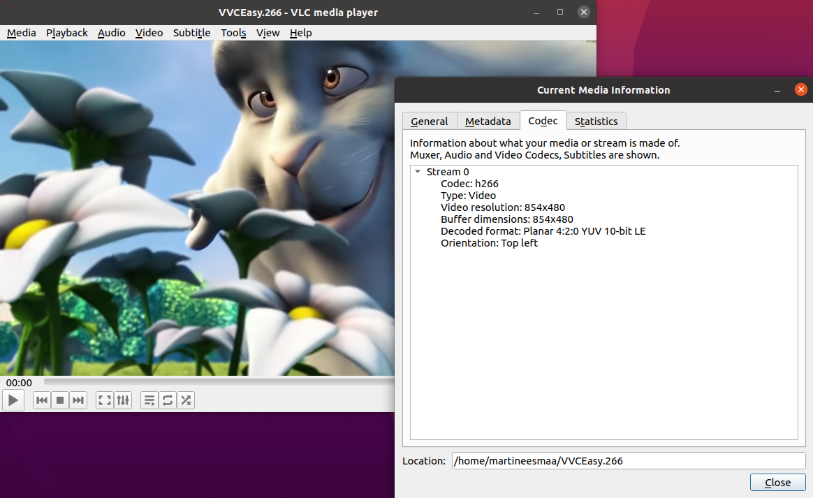

# VLC Media Player (Inter Digital VLC VTM Decoder Plugin installation of Windows and Linux)
This can work only for VLC 3.0.9.2 and later version (eg. 3.0.17.4). VLC 4.0.0-dev won't work.

To install Inter Digital VLC VTM Decoder Plugin, you need VLC Media Player latest version installed on your computer and supported 64-bit.

Step 1: Copy libvtmdec.dll and libvvcdecoder_plugin.dll into your VLC Media Player folder following folder: VLC/plugins/codec

C:\Program Files\VideoLAN\VLC\plugins\codec

Step 2: Copy libvvctsdemux_plugin.dll into your VLC Media Player folder following: VLC/plugins/demux

C:\Program Files\VideoLAN\VLC\plugins\demux

Step 3: Enjoy and play your h266 file into your VLC Media Player :).

### For Linux users

Open terminal and copy code:
```
sudo cp libvvcdecoder_plugin.so /lib/x86_64-linux-gnu/vlc/plugins/codec
sudo cp libvtmdec.so /lib/x86_64-linux-gnu/vlc/plugins/codec
sudo cp libvctsdemux_plugin.so /lib/x86_64-linux-gnu/vlc/plugins/demux
```

VLC from Snap Store:
```
cp libvvcdecoder_plugin.so /snap/vlc/2344/usr/lib/vlc/plugins/codec
cp libvtmdec.so /snap/vlc/2344/usr/lib/vlc/plugins/codec
cp libvctsdemux_plugin.so /snap/vlc/2344/usr/lib/vlc/plugins/demux
```
Preview:



# Build VLC InterDigital Plugin

Explanation of CMAKE names:

VLC_INCLUDE_DIR = Includes of VLC SDK Plugins

VLC_LIB_DIR = Libs of VLC SDK

VLC_PROGRAM_DIR = VLC Program directory

VTMDEC_LIB_NAME = Name title of libvtmdec

VTM_DIR = libvtmdec source files

VLC_SRC_DIR = VLC Source files of the desktop version

DVBPSI_DIR = DVBPSI source files

### Windows

You need the CMAKE GUI, Visual Studio 2017 or newer, VLC SDK, [libvtmdec](https://vcgit.hhi.fraunhofer.de/delagrangep/VVCSoftware_VTM/-/tree/VTM-16.0-MT) precompiled shared dll in lib folder + sources, dvbpsi source and VLC source files of the desktop version. You need to modify vlc_threads.h, before compile.

vlc_threads.h can be found in VLC folder/sdk/include/vlc/plugins. Search `val = poll(fds, nfds, timeout);` and comment the only one file, that's it.


Build Decoder Plugin, see screenshot of CMAKE GUI:


Build TS Demux Plugin, see screenshot of CMAKE GUI:


### Linux

You need CMAKE GUI, build-essentials, VLC SDK, [libvtmdec](https://vcgit.hhi.fraunhofer.de/delagrangep/VVCSoftware_VTM/-/tree/VTM-16.0-MT) sources, dvbpsi source and VLC source files of the desktop version. You need to modify vlc_threads.h, before compile.

vlc_threads.h can be found in VLC folder/sdk/include/vlc/plugins. Search `val = poll(fds, nfds, timeout);` and comment the only one file, that's it.


libvtmdec build:
Compiled file could be found in lib folder in libvtmdec.

```
mkdir build && cd build
cmake -DBUILD_SHARED_LIBS=1 ..
```

dvbpsi build requires of TS Demux Plugin:

```
./bootstrap
./configure --enable-release
make -j
sudo make install
```

Build Decoder Plugin, see screenshot of CMAKE GUI:


Build TS Demux Plugin, see screenshot of CMAKE GUI:


Original documentation must be in the original repository: https://github.com/InterDigitalInc/VTMDecoder_VLCPlugin

### Alternative using command line of Windows

Open Windows Terminal/Windows Command Prompt, make sure you do cd of C:/Users/(put your username)/Downloads/VVCEasy/VLC

Copy code following:
```
copy libvtmdec.dll "%programfiles%\VideoLAN\VLC\plugins\codec" 
copy libvvcdecoder_plugin.dll "%programfiles%\VideoLAN\VLC\plugins\codec"
copy libvvctsdemux_plugin.dll "%programfiles%\VideoLAN\VLC\plugins\demux"
```

Note to VLC 4.0.0-dev users:

The VVC video file cannot loaded by newest version of VLC 4.0.0-dev, because it is nightly build and it's unstable.

For more information about VLC 4.0.0-dev see: https://www.theverge.com/2021/2/12/22279750/vlc-4-0-new-user-interface-videolan-media-player-video-music-movie-database-web-player

I tried build two DLL files on VLC 4.0.0 SDK, but the compiler failed, so you have to use VLC 3.0.9.2 and latest of VLC 3 version branch.

-   Martin Eesmaa
