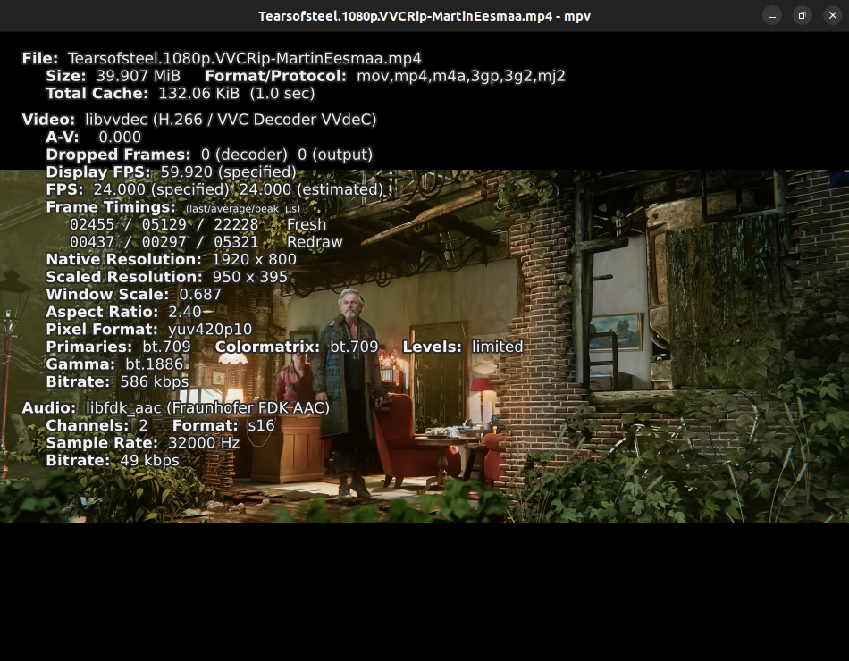

# MPV Windows/Linux/Android Player (libvvdec + xHE-AAC support)

MPV Windows/Linux/Android Player (libvvdec + xHE-AAC support) can play your VVC decoded video file and mixed MP4 container with VVC video codec + audio.

Screenshot preview, see top-left information of toggle stats on Windows/Linux/Android device:




# Download MPV Windows/Android Player (libvvdec + xHE-AAC plugin)

[Windows 7 and later x64](https://mega.nz/file/S5FTSRRQ#LtRFSd9oO_sdoG7m8wYib9OQMlEH91R8pb83Z4ARRZg)

[Windows MPV.NET VVCEasy version x64](https://mega.nz/file/zlcgnJRZ#zAe1-dYNLVXQ59pD0nY1GiXZORpq3ovOqNDk9GY_iyQ)

[Windows MPVLIB VVCEasy version x64](https://mega.nz/file/3tEnHYiR#V0mtvcgpHB0oUzfrYvHgzT52ycTxe9SIIwp8WmnAS6A)

[Linux MPV VVCEasy version x64](https://mega.nz/file/n1k0lJxQ#dHXrjDL2gfVPGlovsvkyw2ngn7zAX97rlOsouvCpGnU)

[Android API 29 .APK Debug (Recommended)](https://mega.nz/file/7wtDiAzZ#fM9JKYKmweuavwhuMGhTlvgvx1ZXTQHF0FlFY1wzSeI)

[Android API 29 .APK Release unsigned](https://mega.nz/file/yk9xFZwT#aH-mPq0aBqTb4xdIhXYL2hNZnp8WBquUB_FZpav6osM)

[Android API 29 .APK Debug with gpu-next](https://mega.nz/file/3p0zyCCI#BRmCY58lwikvck0gbcyFX3IvcGu_7wxZn-mWezaD1uk)

[Android API 29 .APK Release with gpu-next](https://mega.nz/file/C5dyXbpJ#ta2DouVYLOaXeZ6VW9fLqIm7a3I2AoFxWlD-unG18T4)

### Changelog

Please check the changelog before you download the new version.

```
14/08/2023 - Update Android MPV VVCEasy build with vvdec updated.
11/08/2023 - Update Linux MPV VVCEasy build and vvdec.
11/08/2023 - Updated Windows MPV/MPV.NET/MPV LIB VVCEasy build, vvdec, Mediainfo and others.
03/08/2023 - Initial release of MPV Linux version AppImage.
05/07/2023 - Updated MPV/MPV.NET VVCEasy build.
18/06/2023 - Improved codes and new commits of Android MPV VVCEasy custom build standalone.
17/06/2023 - Cross compiled of Windows using Arch Linux for improved libraries and updated FFmpeg, MPV & MPV.NET VVCEasy build. New libmpv build.
04/04/2023 - New Android MPV VVCEasy build with new FFmpeg VVCEasy libraries for updated vvenc and vvdec. For gpu-next build, still experimental.
03/04/2023 - New MPV and MPV.NET latest VVCEasy build with new FFmpeg VVCEasy libraries for updated vvenc, vvdec and added libjxl, shaderc, libplacebo and vulkan to make gpu-next available.
29/03/2023 - Update MPV Android package and icons. Tip: You can have two builds between official and VVCEasy build.
19/02/2023 - Add Android TV support of APK builds & update Android MPV VVCEasy builds.
15/02/2023 - Added Android MPV VVCEasy build with gpu-next support.
14/02/2023 - Update Android MPV VVCEasy build latest, but vulkan support is removed for some reason.
29/01/2023 - Updated vvdec code, mpv.net and others on Windows MPV VVCEasy build.
11/01/2023 - Updated vvdec, added Vulkan with shaderc on MPV Android VVCEasy build.
11/10/2022 - Removed libvorbis + updated SDL2 & mpv.net latest.
10/10/2022 - libplacebo removed (does not work Dolby Vision with my custom build) + update mpv, added zimg, & two improved decoders of libspeex & libvorbis.
11/09/2022 - Complete static adding LDFLAGS="-static" to fix new Intel CPU processor users for mpv.net.
11/09/2022 - Added libplacebo + ffnvcodec.
11/09/2022 - Added optional features: SDL2 gamepad, dvdnav & libbluray.
10/09/2022 - Initial release of MPV.NET.
01/09/2022 - New complete static of Windows MPV VVCEasy build.
```

# Limitations & Tips

MPV Android libvvdec app requires your system type of ARM64 (aarch64), x86 (i686), ARMv7 (armeabi-v7a) and x86_64 to run on Android or Windows requires to run x64.

Windows/Linux/Android MPV Player doesn't work seek duration of VVC decoded file only, but only mp4 video container mixed with VVC video codec is only seek supported, including audio & subtitle too.

Some Android users for 10-bit pixel format or/and tier high might not show video in mp4 container with VVC video codec only.

Solution: Please download latest mp4box nightly version and re-mux from .266 to .mp4 file again.

AppImage needs required fuse installed on your Linux distribution.

Some Linux distributions may not work for AppImage, which may result segmentation fault. Builded & tested on Ubuntu 22.04.2.

### Tips

Make sure to allow apps from unknown sources. Link: [Wikihow](https://www.wikihow.com/Allow-Apps-from-Unknown-Sources-on-Android)

If Google warns you that Android MPV (libvvdec plugin) app is malicious by Play Protect, press "Install anyway" on your phone.

On Windows, there is available MPV.NET custom build on this download. Source code: https://github.com/stax76/mpv.net

# SHA256 SUMS
```
96d27b117e879ef31fe32b969a07c7905b18a3a2c83303c616ac3662ba214398  MPV-VVCEasy-API29debug.apk
4fc32c716d10ffda43efa91ee06477cc86ee46ae54664e06387c2a7cba750496  MPV-VVCEasy-API29release-unsigned.apk
6cca9e73a23a376f704f60e716d1ecc206c290e908b42aab341353f304dacc58  MPV-VVCEasy-API29debug-gpunext.apk
55a4182bf4a0bec8b0236e7de3c2f169a4df33735b842b083951647dbf5bfe64  MPV-VVCEasy-API29release-unsigned-gpunext.apk
d618a1cf6f1319d4934920d5a931e3fdbbc830ccbdb9b1d70cf81a6dbdebde3e  MPV-VVCEasy-Windows-x64.7z
c2f96753c64ca7e14bc966e34615df65abd7ed85d34e4a59f85875528dadf57e  MPV.NET-VVCEasy-Windows-x64.7z
b85d9806519db33204e0fe41ecc8fe3ff26a2e2a83dcca98a5f88d664d748c52  MPVLIB-VVCEasy-Windows-x64.7z
db8b20679ac6d4449accd916b25cb51d14c52eaa001ef63ba2065f97fe293696  MPV-VVCEasy-Linux-x64.7z
```

# Build MPV Android with VVC and xHE-AAC:

If you want to build MPV Android, you need to update & upgrade first, then install packages:
```
sudo apt update && sudo apt upgrade -y
sudo apt install build-essential cmake nasm libsimde-dev python3 git
```

Next download Temurin from Adoptium and follow the install instructions:

https://adoptium.net/installation/linux

After you installed Temurin from Adoptium, you can verify that is installed on your system:
```
java --version
```

After installing the packages on Linux, clone mpv-android-vvc repository:
```
cd
git clone https://github.com/MartinEesmaa/mpv-android-vvc
cd mpv-android-vvc/buildscripts
```

Give shell scripts permission in buildscripts folder:
```
chmod +x scripts/*.sh
```

Before you build, you need to search `#ifdef __ANDROID__` and delete the lines by end `#endif`:

```
nano deps/fdkaac/libSBRdec/src/lpp_tran.cpp
```

Save the file in nano editor, when you finished removing `#ifdef __ANDROID` lines.

**TIP: You can edit script of vvdec.sh on your own choice.**

Continue follow instructions to build your own MPV build:

https://github.com/mpv-android/mpv-android/blob/master/buildscripts/README.md

-   Martin Eesmaa