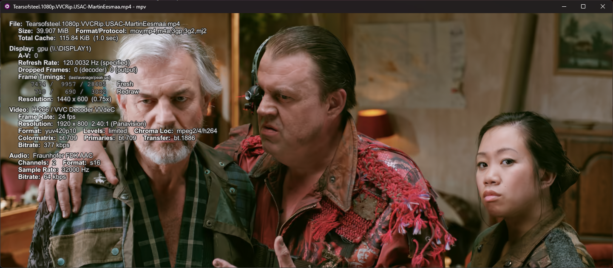
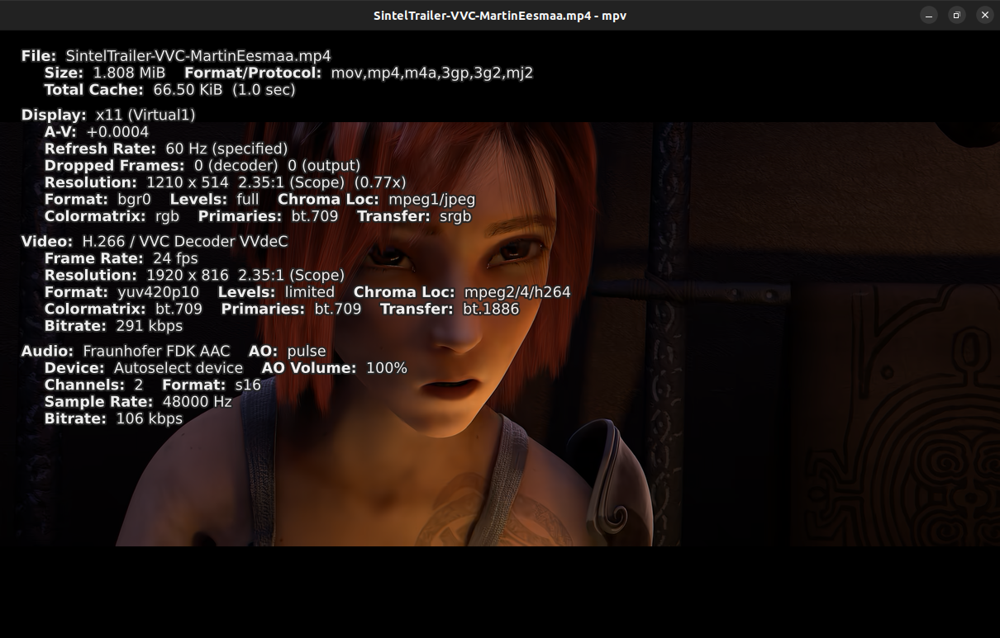
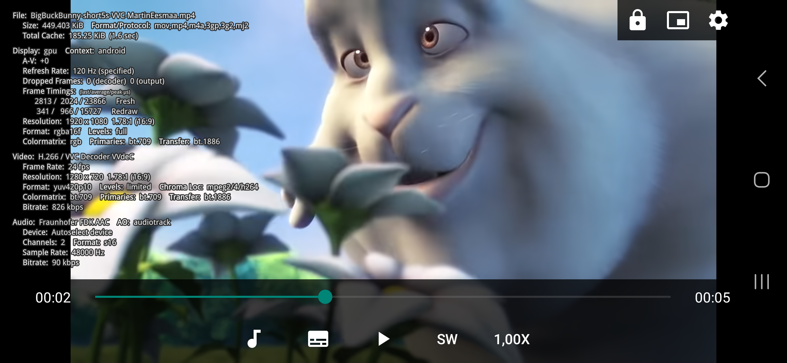

# MPV Windows/Linux/Android Player (libvvdec + xHE-AAC support)


MPV Windows/Linux/Android Player (libvvdec + xHE-AAC support) can play your VVC decoded video file and mixed MP4 container with VVC video codec + audio, also it plays xHE-AAC audio with Fraunhofer FDK library.

Screenshot preview, see top-left information of toggle stats on Windows/Linux/Android device:







## Download MPV Windows/Linux/Android Player (libvvdec + xHE-AAC plugin)

[All releases Windows builds of mpv-winbuild](https://github.com/MartinEesmaa/mpv-winbuild/releases)

[Windows MPV.NET VVCEasy version x64](https://mega.nz/file/OtdxiQhK#cK_8DnjX8nDlcfVBL90W2kNC-QszqXwMGgFZ__vH91E)

[Linux MPV VVCEasy version x64](https://mega.nz/file/ugdWHJ7L#Tc6dsCdQD3fM4YW2fnEd9LDQbTqp2CDdpt-Z8ytcUCM)

[Android API 29 .APK Release signed (Recommended)](https://mega.nz/file/29sEEC6I#IJohZsd0ua7_E2o0BQEjr_-ILpexf_CCKisQt5BQIHU)

[Android API 29 .APK Debug (for debugging)](https://mega.nz/file/e98CQaLS#g7znnn4YsF8UEhUiz3Qr-mMABLI_Zx628Ffmhzk7Id4)

### Deprecated builds

[Windows 7 and later x64](https://mega.nz/file/20syxBgS#69Hs6eKFHJz1seJFVeP1bZ_Qv7Zb4ygCC90rQqfBY7o)

[Windows MPVLIB VVCEasy version x64](https://mega.nz/file/Tl92DKzA#DuE3ZMBT4sd1wOO6YAOZXrj0tMLsGvlbCXlU7YsVWVE)

[Windows 7 and later x86_64-v3 native](https://mega.nz/file/u1l2zTYA#HmiZtkd46EMd9pqcTnhWGC-M3nCv3Y__jLN9T7jLc-c)

[Windows MPVLIB VVCEasy version x86_64-v3 native](https://mega.nz/file/24UggbYD#CsTqPGLa4nEfs_9UheV0auISenDXqFdu465PZfRqozY)

[Manual builds generated Windows x64 on GitHub Actions](https://github.com/MartinEesmaa/mpv-winbuild-cmake/releases)

[Automatic build of Windows on mpv-winbuild](https://github.com/MartinEesmaa/mpv-winbuild/releases/tag/2025-06-23-18defc8)

[Arch Linux MPV VVCEasy version x64](https://mega.nz/file/2pFDTSzT#GwoVQ0u6RStUwjk3rc5LkIzLQgmSDMhgV1Xk8WMeQ-w)

For Windows 7 users, official mpv build already dropped support of Windows 7 for already past little year ago. I can bring back mpv build for Windows 7 support later on later meanwhile three options alternatives way for [eko5624's mpv](https://github.com/eko5624/mpv-win64) of Windows 7 support, MPC-HC or MPC-BE.

I already found that builds vvdec library and implement for eko5624's mpv windows build script:

<https://github.com/eko5624/mpv-win64/tree/static/vvdec-dev>

But still for Fraunhofer FDK external decoder library may not implemented to eko5624's mpv builds.

## Official MPV VVC native decoder implementation

It started at January 4 2024 when the native VVC decoder is released on FFmpeg, but it was experimental without IBC (Intra Block Copy).

On February 24 2024, the finally moment about Intra Block Copy has been merged into FFmpeg's official repository, which means native VVC decoder on FFmpeg is completed and it's stable.

His hard work is very good and made by [nuomi2021](https://github.com/nuomi2021) to make native VVC decoder release to FFmpeg.

Now you can use official MPV binaries by shinchiro or my custom build of MPV VVCEasy build to play or decode VVC in MPV. Also FFmpeg too with Btbn or Gyan or VVCEasy builds. :)

Update of 21.03.2024: On March 14th 2024, the official FFmpeg native VVC decoder set to experimental for some little bugs.

See the FFmpeg commit: <https://github.com/FFmpeg/FFmpeg/commit/110d8549d575aae6b2f627cd63e2eb7082ab8926>

Switched native VVC decoder back to external VVC decoder of libvvdec after native VVC decoder is experimental.

### Changelog

Please check the changelog before you download the new version.

```text
08/12/2025 - Updated Linux MPV VVCEasy build for FFmpeg, vvdec, others and fixed UNIX permissions. Again sorry for almost six months hiatus.
07/12/2025 - Updated Android MPV VVCEasy latest build with FFmpeg, vvdec and others.
07/12/2025 - Updated Windows MPV.NET VVCEasy build with mpv-dev build tag (2025-12-07-dbd7a90) from Martin Eesmaa's mpv-winbuild repo and others.
20/08/2025 - Finally updated of Android MPV VVCEasy latest build and new signed APK with release & debug for new FFmpeg, vvdec and others. After one year and bug code fixes, it is finally updated.
23/06/2025 - Updated Windows MPV/MPV.NET/MPV LIB VVCEasy build with FFmpeg latest, vvenc, vvdec, Mediainfo and others. Sorry about six months and it is automatic build of new forked repo mpv-winbuild.
23/06/2025 - Updated Linux MPV VVCEasy build for FFmpeg, vvdec and others. Sorry for two months hiatus.
01/04/2025 - Fixed Linux MPV VVCEasy build by removing shared object file of libstdc++ for some distributions.
28/03/2025 - Added manual automatic builds of Windows x64 inside GitHub actions on my forked repo.
19/03/2025 - After nine months, it is now updated MPV Linux VVCEasy build with latest version.
07/12/2024 - Updated Windows MPV/MPV.NET/MPV LIB VVCEasy build with FFmpeg latest, vvenc, vvdec, Mediainfo and others. Automatic builds will be soon for Windows, Linux and Android if possible.
07/10/2024 - Updated Windows MPV/MPV.NET/MPV LIB VVCEasy build with FFmpeg for up to 7.1, vvdec up to 3.0.0-rc2, Mediainfo and others.
20/06/2024 - Updated Windows MPV/MPV.NET/MPV LIB & Linux standalone AppImage VVCEasy build with FFmpeg, vvdec, MediaInfo and others.
17/06/2024 - Updated Android MPV VVCEasy latest build by replacing old FFmpeg by current new FFmpeg-VVC.
30/05/2024 - Updated Windows MPV/MPV.NET/MPV LIB VVCEasy build with FFmpeg, vvdec and others.
29/04/2024 - Updated Windows MPV/MPV.NET/MPV LIB & Linux standalone AppImage VVCEasy build with FFmpeg and others. Added official VVC Matroska tag of V_MPEGI/ISO/VVC, also still supports vvc1 fourcc on V_QUICKTIME tag.
28/04/2024 - Updated Windows MPV/MPV.NET/MPV LIB & Linux standalone AppImage VVCEasy build with FFmpeg, MediaInfo and others. Added support matroska VVC demux on MPV & SAC demuxer (code by Martin Eesmaa).
09/04/2024 - Removed unnecessary shared object files of libgbm, libm, libc and libgcc_s on Linux and Arch Linux AppImages, but now standard Linux AppImage works for all Linux distributions without segmentation fault and Arch Linux AppImage works for Arch based only.
08/04/2024 - Updated FFmpeg for up to 7.0 with nightly latest with MPV VVCEasy Linux latest version and others.
07/04/2024 - Fixed the bug of Android MPV VVCEasy builds by allowing & showing permission of Files and media since Android 13 to access all full of files, also older than Android 13 is still fine.
07/04/2024 - Updated Android MPV VVCEasy latest build with FFmpeg for up to 7.0 with nightly, vvdec and others. Removed libxml2 for configuration and compilation error for using latest version and NDK, so next time or some times I'll put libxml2 back when problem is solved. Downgraded from mbedtls v3 to v2 to make sure include "mbedtls/certs.h" is found during FFmpeg compiling.
07/04/2024 - Updated Windows MPV/MPV.NET/MPV LIB VVCEasy build with FFmpeg for up to 7.0 with nightly, MediaInfo and others.
04/04/2024 - Updated FFmpeg latest with MPV VVCEasy Linux latest version, vvdec and others.
22/03/2024 - Added Windows MPV/MPV.LIB VVCEasy native x64-v3 build with use LLVM, Clang, mimalloc and LTO on, requested by Andarwinux at issue #42 improved.
21/03/2024 - Updated Windows MPV/MPV.NET/MPV LIB VVCEasy build with FFmpeg, vvdec and others. Official FFmpeg commit made native VVC decoder set to experimental, now using libvvdec to decode VVC video. Fixed issue #42.
06/03/2024 - Updated Windows MPV/MPV.NET/MPV LIB VVCEasy build with FFmpeg, vvdec and others. Switched from external VVC decoder to native VVC decoder for reduce CPU usage.
01/03/2024 - Just small added words on instructions.
29/02/2024 - Note about official Windows MPV (shinchiro) and VVCEasy builds can play stable video of VVC for playing via decode. I'll release soon later...
20/01/2024 - Updated Windows MPV/MPV.NET/MPV LIB VVCEasy build with FFmpeg, vvdec and others. About vvdec update, this lowers CPU usage than previous build.
05/01/2024 - Updated Windows MPV/MPV.NET/MPV LIB VVCEasy build with FFmpeg and others.
28/12/2023 - Updated Windows MPV/MPV.NET/MPV LIB VVCEasy build with FFmpeg, vvdec, Mediainfo and others.
02/12/2023 - Updated FFmpeg latest with MPV VVCEasy Linux latest version and others.
01/12/2023 - Updated Android MPV VVCEasy latest build
29/11/2023 - Fixed MPV Android VVCEasy build for file picker legacy issue
29/11/2023 - Updated Android MPV VVCEasy build with latest FFmpeg, vvdec and others.
18/11/2023 - Updated FFmpeg with MPV/MPV.NET/MPV LIB VVCEasy Windows build, vvdec and others.
24/10/2023 - Updated Android MPV VVCEasy build with vvdec and others.
23/10/2023 - Removed libmujs for error shared libraries loading reason on Arch Linux.
23/10/2023 - Added X11 support to Arch Linux AppImage of MPV VVCEasy build.
23/10/2023 - Added Arch Linux support to avoid segmentation fault reason, just another new AppImage.
11/10/2023 - Updated Windows MPV/MPV.NET/MPV LIB VVCEasy build, vvdec, Mediainfo and others.
20/09/2023 - Update vvenc & libraries on FFmpeg.
16/09/2023 - Update MPV Linux VVCEasy build with libraries.
14/08/2023 - Update Android MPV VVCEasy build with vvdec updated.
11/08/2023 - Update Linux MPV VVCEasy build and vvdec.
11/08/2023 - Updated Windows MPV/MPV.NET/MPV LIB VVCEasy build, vvdec, Mediainfo and others.
03/08/2023 - Initial release of MPV Linux version AppImage.
05/07/2023 - Updated MPV/MPV.NET VVCEasy build.
18/06/2023 - Improved codes and new commits of Android MPV VVCEasy custom build standalone.
17/06/2023 - Cross compiled of Windows using Arch Linux for improved libraries and updated FFmpeg, MPV & MPV.NET VVCEasy build. New libmpv build.
04/04/2023 - New Android MPV VVCEasy build with new FFmpeg VVCEasy libraries for updated vvenc and vvdec. For gpu-next build, still experimental.
03/04/2023 - New MPV and MPV.NET latest VVCEasy build with new FFmpeg VVCEasy libraries for updated vvenc, vvdec and added libjxl, shaderc, libplacebo and vulkan to make gpu-next available.
29/03/2023 - Update MPV Android package and icons. Tip: You can have two builds between official and VVCEasy build.
19/02/2023 - Add Android TV support of APK builds & update Android MPV VVCEasy builds.
15/02/2023 - Added Android MPV VVCEasy build with gpu-next support.
14/02/2023 - Update Android MPV VVCEasy build latest, but vulkan support is removed for some reason.
29/01/2023 - Updated vvdec code, mpv.net and others on Windows MPV VVCEasy build.
11/01/2023 - Updated vvdec, added Vulkan with shaderc on MPV Android VVCEasy build.
11/10/2022 - Removed libvorbis + updated SDL2 & mpv.net latest.
10/10/2022 - libplacebo removed (does not work Dolby Vision with my custom build) + update mpv, added zimg, & two improved decoders of libspeex & libvorbis.
11/09/2022 - Complete static adding LDFLAGS="-static" to fix new Intel CPU processor users for mpv.net.
11/09/2022 - Added libplacebo + ffnvcodec.
11/09/2022 - Added optional features: SDL2 gamepad, dvdnav & libbluray.
10/09/2022 - Initial release of MPV.NET.
01/09/2022 - New complete static of Windows MPV VVCEasy build.
```

## Limitations & Tips

MPV Android libvvdec app requires your system type of ARM64 (aarch64), x86 (i686), ARMv7 (armeabi-v7a) and x86_64 to run on Android, Windows requires to run x64 or Linux requires to run x64.

Windows/Linux/Android MPV Player doesn't work seek duration of VVC decoded file only, but only mp4 video container mixed with VVC video codec is only seek supported, including audio & subtitle too.

Some Android users for 10-bit pixel format or/and tier high might not show video in mp4 container with VVC video codec only.

Solution: Please download latest mp4box nightly version and re-mux from .266 to .mp4 file again.

AppImage needs required fuse installed of your Linux distribution on your computer.

Some Linux distributions may not work for AppImage, which may result segmentation fault. Builded & tested on Ubuntu 22.04.2.

About Linux MPV VVCEasy AppImage problem before solution: The problem was that I put four shared object files of libgbm, libm, libc and libgcc_s on both AppImages, which makes some Linux distributions problem

Solution: Please update latest version of Linux or Arch Linux MPV VVCEasy AppImage, because I removed four shared object files of libgbm, libm, libc and libgcc_s to make all Linux distributions work on standalone Linux AppImage, also includes Arch Linux AppImage can work for only all Arch based operating systems.

If you're using Arch Linux or Arch based, please download the Arch Linux AppImage version. You can still use standalone Linux AppImage on Arch Linux or Arch based systems.

### Tips

Make sure to allow apps from unknown sources. Link: [Wikihow](https://www.wikihow.com/Allow-Apps-from-Unknown-Sources-on-Android)

If Google warns you that Android MPV (libvvdec plugin) app claimed is malicious by Play Protect, press "Install anyway" on your phone.

On Windows, there is available MPV.NET custom build on this download. You can have look for source code: <https://github.com/stax76/mpv.net>

## SHA256 SUMS

```text
86688ed872173e70678d36454b05b5b2dce09eb71587ae9706dccac38c865122  MPV-VVCEasy-API29debug-signed.apk
c2129528da3cc880dd15b02da9e277cd7f374119d49bc7b05ea54f5d385b43d3  MPV-VVCEasy-API29release-signed.apk
9044b7d67eaa020d5e59d437b3fc10dd2e6f60eedfff8034c4dd608145bff17d  MPV-VVCEasy-Windows-x64.7z
0326a442f6ce1b23cc597016c6fe99c844618744260be6dc036df6f284f04bd4  MPV.NET-VVCEasy-Windows-x64.7z
7cb80e644657e0447eea33c51517ae428ed841cdc7d0b4155f986ab5226c5894  MPVLIB-VVCEasy-Windows-x64.7z
8d486291a371c8663e7ddd1d9845cf54f81c316a9c795333a5b490f7621a6cb3  MPV-VVCEasy-Windows-NativeX64.7z
003dbdf1cd6639ff906c2c17dde69a16c1df7fa565cf310ba014ea24b5b330a5  MPVLIB-VVCEasy-Windows-NativeX64.7z
430402131e64190b7bfb4566fd5fa5ef760e1c20c6da31c8ed5049c5a146e020  MPV-VVCEasy-Linux-x64.7z
ab23b1928069bd3584297dae1d90a95fe2910f91936766ddfa5bdafd53c8a300  MPV-VVCEasy-ArchLinux-x64.7z
```

## Build MPV Android with VVC and xHE-AAC

If you want to build MPV Android, you need to first update & upgrade, then install packages:

```bash
sudo apt update && sudo apt upgrade -y
sudo apt install build-essential cmake nasm libsimde-dev python3 python3-pip git openjdk-17-jdk
sudo pip install meson -U
```

## Optional for install Temurin from Adoptium

Note: If you already installed Temurin from Adoptium
or normal Java package from package manager, you can skip this step.

Next download Temurin from Adoptium and follow the install instructions:

<https://adoptium.net/installation/linux>

---

After you installed Java JDK from package manager or Temurin from Adoptium, you can verify that is installed on your system:

```bash
java --version
```

After installing the packages on Linux, clone mpv-android-vvc repository:

```bash
cd
git clone https://github.com/MartinEesmaa/mpv-android-vvc
cd mpv-android-vvc/buildscripts
```

**TIP: You can edit script of vvdec.sh by your own choice.**

Continue follow instructions to build your own MPV build:

<https://github.com/MartinEesmaa/mpv-android-vvc/blob/master/buildscripts/README.md>

- Martin Eesmaa
