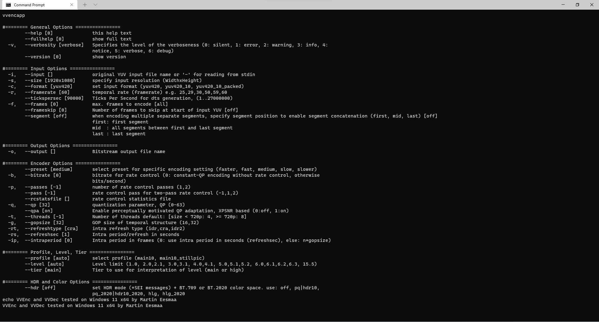
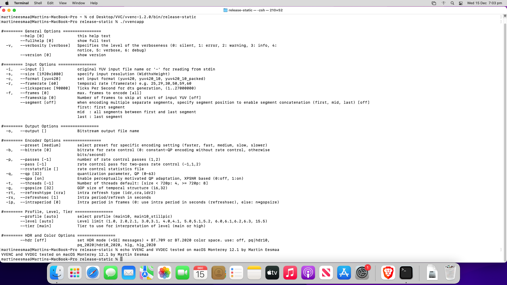
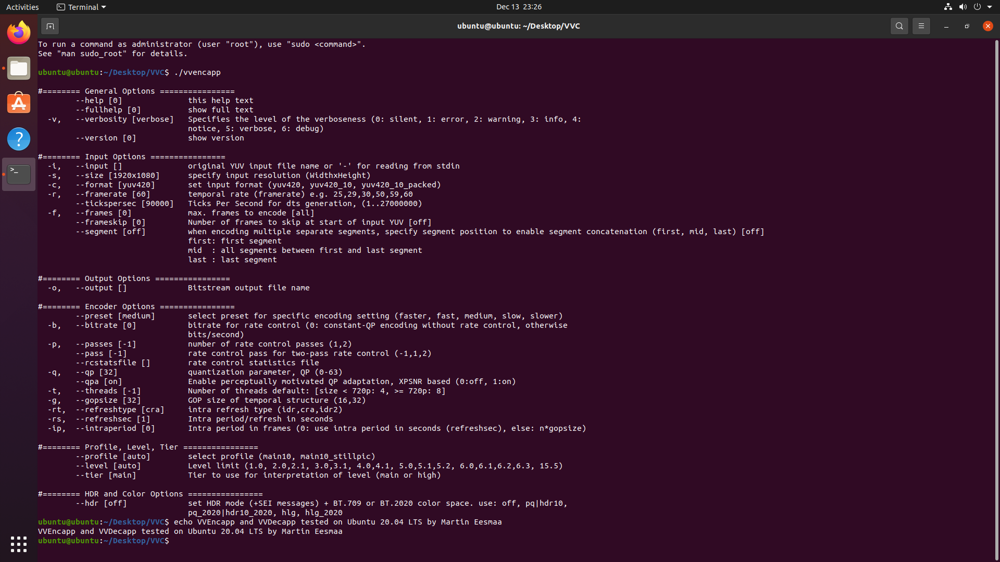
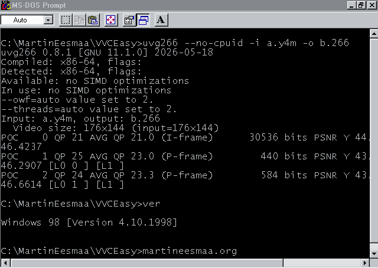
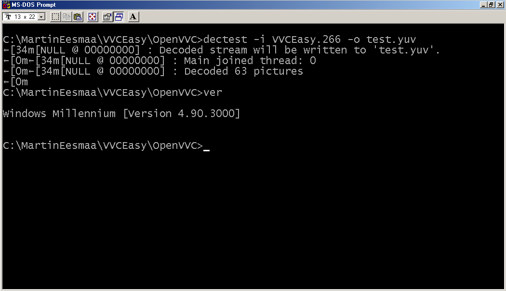

# Versatile Video Codec binaries

Versatile Video Codec binaries has available two tools for you to choose.

## Fraunhofer HHI (vvenc/vvdec)

Fraunhofer HHI VVC binaries is just standard easy tool, which allows to encode & decode with arguments and also encodes good quality for slow preset, but it may be slow...

* C++14 programming language
* Supports Windows, macOS, Linux, BSD, Android, iOS (library only with new app or non-signed binary executable on jailbroken device) & WebAssembly.
* SIMDE: SCALAR, SSE4.1, SSE4.2, AVX, AVX2, AVX512 (unsupported yet), NEON (arm only) and WASM (Web browsers only).
* Faster depends speeding up for newer computer machine of CPUs.
* Presets can be used from faster to slower.
* Includes advanced tool of encode (vvencFFapp)
* Two-pass control of bitrate is only allowed.
* Default encoding pixel format is 10-bit.
* For decoding, it can output to YUV, Y4M or pipe.
* Lossless encoding (only for vvencFFapp with CostMode argument)

Old screenshots in 2021 of three desktop operating systems:

Windows:


Mac:


Linux:


## uvg266 (VVC Scalable encoder tool)

uvg266 is only scalable encoder which helps to make it faster for older & newer computers, but still a bit good quality than vvenc, seems okay.

* C11 programming language
* Supports Windows, macOS, Linux, BSD, Android & iOS (library only with new app or non-signed binary executable on jailbroken device).
* SIMDE: SSE2, SSE4.1, SSE4.2, AVX2 & AltiVec (PowerPC only).
* Can only encode 8-bit VVC output for rest operating system supported, but for 10-bit needs compiled with definition, this only works for Android users.
* Faster encoding scalable of old & new computers than vvenc.
* Supports presets from ultrafast to placebo like x264 presets, however it is recommended to use from faster to slower to avoid VVC decoding fail issue.
* Lossless encoding is not recommended due decoding fail.

For Windows 98/ME/2000 to Windows XP users, please use command argument `--no-cpuid` to disable runtime CPU optimizations to avoid errors. Use i386 architecture binary of uvg266.

Tested using Windows 98 (First Edition) with PCem v17 Pentium II 300MHZ to encode raw Y4M uncompressed video file into VVC 8-bit raw video file using uvg266:



## OpenVVC (VVC decoder open license)

OpenVVC is another VVC decoder library licensed under LGPLv2.1.

* C89 programming language
* Supports Windows, macOS, Linux, BSD, Android & iOS.
* Supports SIMD optimizations of x86 (SSE & AVX2) and ARM.
* Most modern VVC encoded files do not work at all, some old VVC encoded files works
* Still faster decoding, outputs to YUV only.
* Lossless decoding VVC is not supported.
* Optional SLHDR external library to support decode HDR videos

Tested using Windows ME to decode old VVC video file 10-bit SDR into raw YUV uncompressed video:



### Minimum requirements

**vvdec/vvenc**:

* Windows XP and later (requires Visual C++ Redistributable for Visual Studio 2019 installed)
* Mac OS X 10.9 and later (arm64 since macOS 11.0)
* Linux kernel 3.2.0 and later (eg. Ubuntu 12.04 LTS and later)
* FreeBSD 9.0 and later
* OpenBSD 6.6 and later
* Android 4.1 (API 16, Jelly Bean) and later (arm64 & x86_64 since Android 5.0)
* Haiku OS (x86_64 only)

**uvg266**:

* Windows 98 and later
* Mac OS X 10.4 and later (amd64 since Mac OS X 10.4, x86 from Mac OS X 10.6 to 10.14, arm64 since macOS 11.0)
* Linux kernel 2.6.32 and later (eg. Ubuntu 10.04 LTS and later)
* FreeBSD 9.0 and later
* OpenBSD 6.6 and later
* Android 4.3 (API 18, Jelly Bean) and later (arm64 & x86_64 since Android 5.0)
* Haiku OS (x86_64 only)
* Oracle Solaris 11

**OpenVVC**:

* Windows 98 and later
* Mac OS X 10.4 and later
* Linux kernel 2.6.32 and later (eg. Ubuntu 10.04 LTS and later)
* FreeBSD 9.0 and later
* OpenBSD 6.6 and later
* Android 4.0.1 (API 14, Ice Cream Sandwich) and later
* Haiku OS (x86_64 only)
* Oracle Solaris 11

### Downloads

NOTE: uvg266 compiled by same architectures supported of vvdec & vvenc.

All compiled builds are compressed files on 7-Zip.

| OS | vvdec & vvenc | uvg266 |
| --- | --- | --- |
| Windows | [x64/x86](https://github.com/MartinEesmaa/VVCEasy/raw/refs/heads/master/WindowsVVC/WindowsVVC.7z) | [Download](https://github.com/MartinEesmaa/VVCEasy/raw/refs/heads/master/uvg266/Windows/uvg266-Windows.7z) |
| macOS | [Arm64/x64](https://github.com/MartinEesmaa/VVCEasy/raw/refs/heads/master/MacOSVVC/MacOSVVC.7z) | [Download](https://github.com/MartinEesmaa/VVCEasy/raw/refs/heads/master/uvg266/macOS/uvg266-macOS.7z) |
| Linux | [x86_64/x86/arm64/armv7a](https://github.com/MartinEesmaa/VVCEasy/raw/refs/heads/master/uvg266/Linux/uvg266-Linux.7z) | [Download](https://github.com/MartinEesmaa/VVCEasy/raw/refs/heads/master/uvg266/Linux/uvg266-Linux.7z) |
| FreeBSD | [x86_64](https://github.com/MartinEesmaa/VVCEasy/raw/refs/heads/master/BSDVVC/BSDVVC.7z) | [Download](https://github.com/MartinEesmaa/VVCEasy/raw/refs/heads/master/uvg266/BSD/uvg266-BSD.7z) |
| Android | [x86_64/x86/arm64/armv7a](https://github.com/MartinEesmaa/VVCEasy/raw/refs/heads/master/AndroidVVC/AndroidVVC.7z) | [Download](https://github.com/MartinEesmaa/VVCEasy/raw/refs/heads/master/AndroidVVC/AndroidUVG266-8bit.7z) or [10-bit build](https://github.com/MartinEesmaa/VVCEasy/raw/refs/heads/master/AndroidVVC/AndroidUVG266.7z) |
| Haiku | [x86_64](https://github.com/MartinEesmaa/VVCEasy/raw/refs/heads/master/HaikuVVC/HaikuVVC.7z) | [Download](https://github.com/MartinEesmaa/VVCEasy/raw/refs/heads/master/uvg266/Haiku/uvg266-HaikuOS.7z) |

### Distribution packages installation

Some operating systems supports VVC packages of vvdec/vvenc or/and uvg266.

Official distributions packages of VVC and uvg266: FreeBSD 14+, OpenBSD, Homebrew (macOS & Linux) and OpenMandriva.

Third party packages of VVC and uvg266: Arch Linux, Enterprise Linux 10, Debian 11+, Fedora 43+, openSUSE Leap 16.0/Tumbleweed and Slackwave 15.0+.

Official stable version package from command installation:

```text
# FreeBSD 14+
pkg install vvdec vvenc uvg266
# OpenBSD
pkg_add vvdec vvenc
# Homebrew
brew install vvdec vvenc
# OpenMandriva
dnf install vvdec vvenc
```

## Comparisions between vvenc/vvdec and uvg266

If you're using newer computer or/and you wanted it to encode 10-bit with fast encoding to get good quality, use vvenc recommended.

If you're using older computer or/and more faster encoding of 8-bit than vvenc, use uvg266 recommended.

Also for decoding, use vvdec and also it is faster decoding for older (possible) & newer computers.
